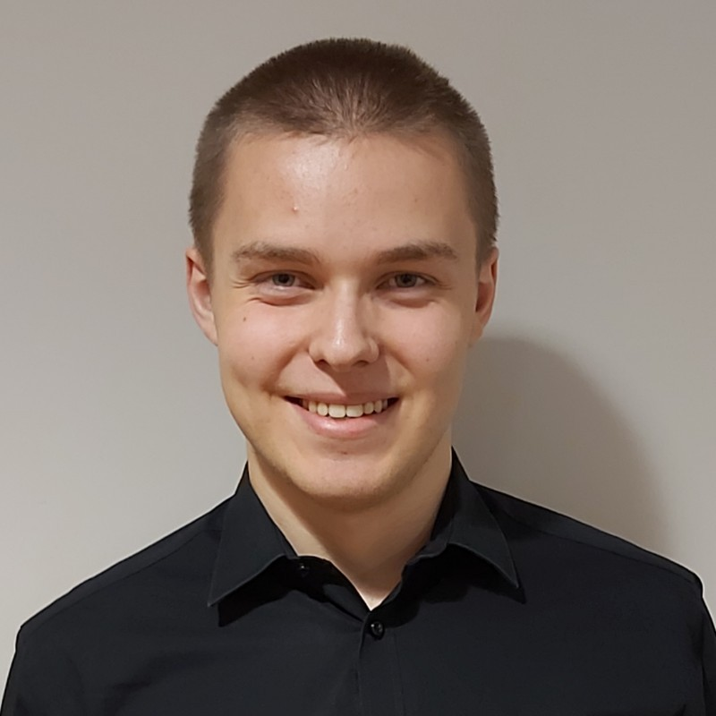

Hello and welcome. I am Harry Mason, a Computer Science student from Bedford. I am looking for summer internships.

## What's Next?
### Projects Under Construction:

Skin Lesion Detection Using Image Classification

### Planned Projects:

A natural language processing project.
A series of web apps that implement machine learning algorithms.
